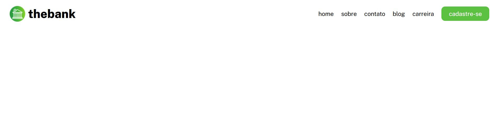

# menu responsivo com flexbox

## 
projeto do curso devemdobro que cria um menu responsivo 

## Indice 


- [funcionalidades do projeto](#funcionalidades-do-projeto)
- [layout](#layout)
- [Como rodar este código](#como-rodar-este-código)
- [tecnologias utilizadas](#tecnologias-utilizadas)
- [pessoas autoras](#pessoas-autoras)


## Funcionalidades do projeto 

- [x] logo
- [x] nome da marca fictícia
- [x] home
- [x] sobre
- [x] contato
- [x] blog
- [x] carreira
- [x] botão de cadastre-se

## Layout


## Como rodar este código

```bash
#clone este repositório

$git clone https://github.com/cmilesnts/menu-responsivo.git

#acesse a pasta do projeto no seu terminal 

$cd menu-responsivo 

#intale as dependências

$npm install 

#execute a aplicação

$npm run start 

```

## Tecnologias utilizadas

1. <a href="https://www.w3schools.com/html/">html</a>
2. <a href="https://www.w3schools.com/css/">css</a>


## Pessoas autoras

Camile santos 


